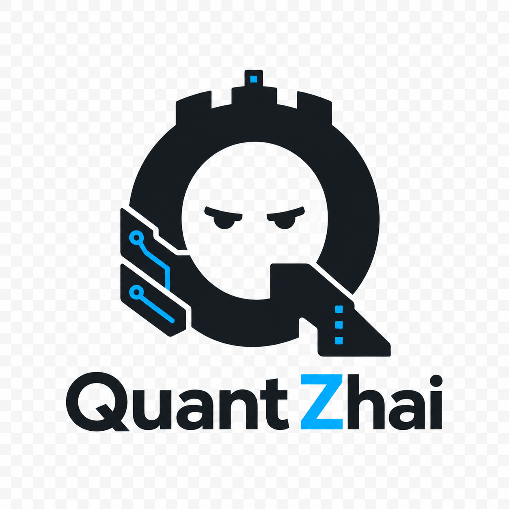

<p align="center">
  
</p>

# QuantZhai

QuantZhai is a local Codex stack for running Qwen through a turboquant llama.cpp server with an OpenAI-compatible proxy.

This directory is the cleaned seed, not the discovery dump. Runtime state lives under `var/` and stays out of git.

## Status

QuantZhai is early but has run locally in a useful Codex workflow. Treat it as a reproducible lab stack, not a polished installer.

Known-good host used during initial bring-up:

```text
OS: Devuan GNU/Linux 6 excalibur
Kernel: Linux 6.12.73+deb13-amd64
Shell: bash 5.2
Docker: requires sudo on this host
Driver: NVIDIA 575.57.08
CUDA reported by nvidia-smi: 12.9
GPU 0: NVIDIA GeForce RTX 3080 10GB
GPU 1: NVIDIA Tesla V100-SXM2 16GB
Memory: 47GB RAM, 16GB swap
```

The tested launch split model state across both GPUs. Smaller or different models may work on less hardware; this README only documents the setup known to have worked here.

## Architecture

```text
Codex CLI
  -> QuantZhai proxy on 127.0.0.1:18180
  -> llama.cpp router on 127.0.0.1:18084
  -> local GGUF model directory mounted into Docker
```

The proxy exists because Codex expects OpenAI-style Responses behavior, model catalog metadata, streaming events, rate-limit headers, tool-call normalization, and local compaction behavior. The proxy now owns model catalog selection and tells the router which GGUF to load. The Docker server does the model inference.

## What Ships

- `proxy/quantzhai_proxy.py`: local Responses API bridge for Codex.
- `scripts/qz-up`: starts the turboquant llama.cpp Docker server and proxy.
- `scripts/qz-build-image`: builds the local turboquant llama.cpp Docker image.
- `scripts/qz-proxy`: starts or restarts only the proxy.
- `scripts/qz-codex`: runs Codex against the local proxy.
- `scripts/qz-down`: stops the proxy and QuantZhai container.
- `scripts/qz-doctor`: checks local prerequisites.
- `scripts/qz-clean-legacy`: stops the old source-tree proxy and shared container.
- `config/`: publishable Codex config and model catalog examples.

## Runtime Layout

```text
var/
  codex-home/   # Codex config, sessions, history, sqlite state, plugin/cache data
  logs/         # Proxy logs
  captures/     # latest request/response/debug captures
  run/          # pid files
```

`scripts/qz-codex` sets:

```bash
CODEX_HOME="$PWD/var/codex-home"
CODEX_SQLITE_HOME="$PWD/var/codex-home/sqlite"
CODEX_OSS_BASE_URL="http://127.0.0.1:18180"
```

That keeps the Codex environment for this stack inside `quantzhai/var/codex-home` instead of the global `~/.codex`, assuming the Codex CLI honors `CODEX_HOME` for the operation being run.

## Requirements

- Docker with NVIDIA GPU support.
- `nvidia-smi` visible on the host.
- A turboquant llama.cpp server image, or enough build tooling to create it.
- A local Qwen GGUF model.
- `codex` CLI available on `PATH`.
- Python 3.

Known local Docker image:

```text
thetom-llama-cpp-turboquant:cuda-server
```

This is a local image tag. It is not assumed to exist in a public registry.

If Docker needs sudo on your machine, set this in `.env`:

```bash
QZ_DOCKER_CMD="sudo docker"
```

For non-interactive Codex runs on sudo-only hosts, install the narrow helper
once:

```bash
scripts/qz-install-sudo-helper
```

Then set this in `.env`:

```bash
QZ_DOCKER_CMD="sudo -n /usr/local/sbin/qz-docker-quantzhai"
```

The helper is copied to a root-owned path and sudoers grants passwordless sudo
only for that helper. It allows the Docker operations used by `qz-up`,
`qz-down`, `qz-doctor`, and `qz-top` with the default local image tag; it does
not allow Docker builds. For manual setup, you can still run scripts in a
terminal where sudo can prompt, pre-auth with `sudo -v`, or add the user to the
Docker group if that is acceptable for the machine.

## Build Docker Image

If `scripts/qz-doctor` says the Docker image is missing, build it locally:

```bash
scripts/qz-build-image
```

That script clones or updates:

```text
https://github.com/TheTom/llama-cpp-turboquant.git
```

Default branch:

```text
feature/turboquant-kv-cache
```

Default image tag:

```text
thetom-llama-cpp-turboquant:cuda-server
```

Default build directory:

```text
$HOME/turboquant-work/llama-cpp-turboquant
```

Default CUDA architectures:

```text
70;86
```

Those match the known-good Tesla V100 plus RTX 3080 host. Change `QZ_CUDA_ARCH` in `.env` for other GPUs.

## Quick Start

```bash
cd quantzhai
cp .env.example .env
$EDITOR .env
scripts/qz-doctor
scripts/qz-build-image   # only needed if qz-doctor reports missing image
scripts/qz-clean-legacy
scripts/qz-up
scripts/qz-codex high
```

Default profile aliases:

```text
low
medium
caveman
high
max
```

These aliases currently map to these Codex model names:

```text
Qwen3.6Turbo-low
Qwen3.6Turbo-medium
Qwen3.6Turbo-caveman
Qwen3.6Turbo-high
Qwen3.6Turbo-max
```

`caveman` is an experimental compact-instructions profile. `scripts/qz-codex caveman`
loads `docs/qz-caveman-codex-model-instructions-v2.md` and caps Codex output at
2048 tokens for that session.

`scripts/qz-codex` passes remaining arguments through to Codex after the optional
profile. For example:

```bash
scripts/qz-codex caveman resume 019dd7a5-ca8b-7b31-994e-fcde3def5824
scripts/qz-codex caveman resume --last
```

## Benchmark Harness

Run fixed Codex exec prompts against local profiles:

```bash
scripts/qz-up
scripts/qz-benchmark high caveman
```

Benchmark artifacts are written under `var/benchmarks/`, including per-case
Codex JSONL events, final answers, proxy captures, and a run summary. The latest
summary is also shown by `scripts/qz-top`. The main compression metric is input
token ratio versus the baseline profile; instruction, final-answer, total-token,
and wall-time ratios are recorded too.

If the backend is healthy but the proxy is not running, `qz-benchmark` starts a
temporary proxy for the run. Pass `--no-manage-proxy` to require an existing
proxy.

The prompt fixture lives at:

```text
config/qz-benchmark-prompts.json
```

See `docs/quantzhai-benchmark-harness.md` for metrics and focused runs.

## Configuration

Main local config lives in `.env`.

Important settings:

- `QZ_IMAGE`: Docker image for the turboquant llama.cpp server.
- `QZ_DOCKER_CMD`: Docker command, usually `docker` or `"sudo docker"`.
- `QZ_CONTAINER`: container name, default `qwen36turbo`.
- `QZ_BUILD_DIR`: external build workspace for the turboquant source clone.
- `QZ_TQ_REPO`: turboquant llama.cpp Git repository.
- `QZ_TQ_BRANCH`: turboquant branch to build.
- `QZ_CUDA_ARCH`: CUDA architectures for the Docker build.
- `QZ_MODEL_DIR`: directory scanned for local `*.gguf` files, default `var/models`.
- `QZ_MODEL_KEY`: optional explicit selection by filename, stem, or model alias.
- `QZ_MODEL_OVERRIDES`: local JSON overrides file, default `var/model-overrides.json`.
- `QZ_SERVER_PORT`: host port for llama.cpp server, default `18084`.
- `QZ_PROXY_PORT`: host port for QuantZhai proxy, default `18180`.
- `QZ_CONTEXT`: context window, default `131072`.
- `QZ_PARALLEL`: llama.cpp parallel slots, default `1`.
- `QZ_BATCH` / `QZ_UBATCH`: batch settings, defaults `4096` and `512`.
- `QZ_TENSOR_SPLIT`: GPU split passed to llama.cpp, default `9,17`.
- `QZ_CACHE_RAM` / `QZ_CACHE_REUSE`: prompt cache settings, defaults `8192` and `256`.
- `QZ_KV_KEY` / `QZ_KV_VALUE`: KV cache quant settings.
- `SEARXNG_BASE_URL`: optional SearXNG base URL for local web search. Leave empty to disable search.
- `SEARXNG_POLICY`: search routing policy, default `docs/searxng-agent-policy-profiled.json`.

The current defaults came from the working two-GPU Qwen3.6 setup. They are not universal.

`proxy/qz_model_catalog.py` scans `QZ_MODEL_DIR`, merges
`config/qz-model-overrides.example.json` with `QZ_MODEL_OVERRIDES` if present,
writes `var/model-inventory.json`, and feeds the proxy's `/v1/models`,
`/qz/models`, and model-load paths.

## Local Search

QuantZhai can expose one local `web_search` tool to Codex when `SEARXNG_BASE_URL` points at a running SearXNG instance.

Search supports profiles:

```text
auto
broad
coding
sysadmin
research
news
ai_models
reference
```

Normal use should leave `profile` as `auto`. The proxy routes the query through `docs/searxng-agent-policy-profiled.json`, filters disabled or non-text engines, and writes the latest routing decision to:

```text
var/captures/latest-web-search-route.json
```

Example `.env` setting:

```bash
SEARXNG_BASE_URL=http://127.0.0.1:8080
```

Quick smoke test:

```bash
source scripts/qz-env
curl "$SEARXNG_BASE_URL/search?q=quantzhai%20smoke%20test&format=json"
scripts/qz-proxy
```

Useful test queries for Codex or a proxy-level smoke:

```text
latest qwen gguf release
python json decode error stdin
define shanzhai
```

## Useful Commands

Check environment:

```bash
scripts/qz-doctor
```

Start server and proxy:

```bash
scripts/qz-up
```

If a terminal window is configured to close when its command finishes, use:

```bash
scripts/qz-up --hold
```

To start the stack and enter Codex in one command:

```bash
scripts/qz-up --codex high
```

Restart only proxy:

```bash
scripts/qz-proxy
```

Run Codex:

```bash
scripts/qz-codex high
```

Watch streamed reasoning/thought output from the latest proxy request:

```bash
scripts/qz-thoughts
```

Stop QuantZhai:

```bash
scripts/qz-down
```

Stop old source-tree process/container:

```bash
scripts/qz-clean-legacy
```

## Troubleshooting

If `qz-doctor` says Docker image missing, check local images:

```bash
sudo docker images
```

Then build the image:

```bash
scripts/qz-build-image
```

If `qz-doctor` says Docker daemon access failed, fix Docker permissions first.
For Codex-driven runs, prefer the non-interactive helper from the requirements
section. With plain `QZ_DOCKER_CMD="sudo docker"`, run the script in a real
terminal where sudo can prompt, or refresh sudo with `sudo -v` before setup
commands.

If `qz-proxy` says the port is in use, clear old proxy processes:

```bash
scripts/qz-clean-legacy
scripts/qz-proxy
```

If Codex says `Pulling model ...` then fails, check that `qz-codex` is using the local model catalog under `var/codex-home/model-catalogs/` and that the proxy is reachable:

```bash
curl http://127.0.0.1:18180/v1/models
```

If the proxy starts but requests fail, inspect:

```text
var/logs/qz-proxy.log
var/captures/latest-request.json
var/captures/latest-forwarded.json
var/captures/latest-json-api.log
```

If the model server fails or exits, inspect Docker:

```bash
sudo docker ps -a
sudo docker logs qwen36turbo
```

## Git Hygiene

Do not commit:

```text
.env
var/
models/
*.gguf
*.safetensors
logs/
captures/
run/
```

These may contain local paths, prompts, tool output, secrets, request captures, sqlite state, sessions, or model blobs.

## Roadmaps

- `docs/search-roadmap.md`: profile-aware local search plan.
- `docs/fox-roadmap.md`: future Fox backend evaluation and parity gate.
- `docs/proxy-architecture-roadmap.md`: Python proxy restructure, test harness, and possible Rust port.
- `docs/agent-runtime-session-notes-2026-04-29.md`: compact-profile,
  benchmark, observability, streaming, search, and time-grounding notes from
  the 2026-04-29 tuning session.

## Name

`Zhai` comes from `shanzhai`: scrappy, DIY, mountain-fort energy. QuantZhai means local quant stack built from practical parts.
