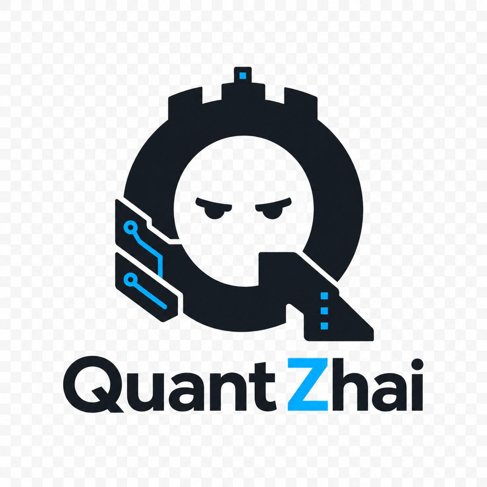

<p align="center">
  
</p>

# QuantZhai

QuantZhai is a local Codex stack for running Qwen through a turboquant llama.cpp server with an OpenAI-compatible proxy.

It is built as a cleanly isolated, optional wrapper around a normal Codex install. If you stop using QuantZhai, you can remove the repo and its `var/` state without disturbing your native Codex setup. The point is to make a local agent box you can shape, test, replay, and remove cleanly.

This repository is the cleaned seed. Runtime state lives under `var/` and stays out of git.

## Why This Matters

QuantZhai is useful because it gives you a local agent stack with real guardrails:

- isolated from a native Codex install
- driven by profile-level behavior instead of one fixed prompt
- backed by golden replay fixtures and unit tests
- able to model turn-level harnesses for roleplay and compact modes
- able to swap model profiles with symlinks instead of runtime surgery
- wrapped in simple start, stop, doctor, smoke, and Codex runner scripts

That makes it practical for home-lab experimentation, prompt/profile work, and small custom-agent deployments that need to stay reproducible.

## Documentation

Start with the [documentation index](docs/README.md) for a browsable map of the repo docs, recommended reading paths, and task-oriented entry points.

## Status

QuantZhai is early but has already run locally in a useful Codex workflow. Treat it as a reproducible lab stack, not a polished installer.

Current coverage is not hand-wavy:

- 187 unit tests lock down established behavior.
- Golden replay fixtures cover proxy logic, stream normalization, tool state, and patch adapter paths.
- Live smoke tests cover the proxy, `apply_patch`, and Codex exec flows.
- Symlink-based model profiles, prompt injection, and turn harnesses are all part of the runtime contract.
- The wrapper is intended to stay removable and non-destructive to a native Codex install.

Known-good host used during initial bring-up:

```text
OS: Devuan GNU/Linux 6 excalibur
Kernel: Linux 6.12.73+deb13-amd64
Shell: bash 5.2
Docker: requires sudo on this host
Driver: NVIDIA 575.57.08
CUDA reported by nvidia-smi: 12.9
GPU 0: NVIDIA GeForce RTX 3080 10GB
GPU 1: NVIDIA Tesla V100-SXM2 16GB
Memory: 47GB RAM, 16GB swap
```

The tested launch split model state across both GPUs. Smaller or different models may work on less hardware; this README only documents the setup known to have worked here.

## Architecture

```text
Codex CLI
  -> QuantZhai proxy on 127.0.0.1:18180
  -> llama.cpp router on 127.0.0.1:18084
  -> local GGUF model directory mounted into Docker
```

The proxy exists because Codex expects OpenAI-style Responses behavior, model catalog metadata, streaming events, rate-limit headers, tool-call normalization, and local compaction behavior. The proxy now owns model catalog selection and tells the router which GGUF to load. The Docker server does the model inference.

## What Ships

- `proxy/quantzhai_proxy.py`: local Responses API bridge for Codex.
- `scripts/qz-up`: starts the turboquant llama.cpp Docker server and proxy.
- `scripts/qz-build-image`: builds the local turboquant llama.cpp Docker image.
- `scripts/qz-proxy`: starts or restarts only the proxy.
- `scripts/qz-codex`: runs Codex against the local proxy.
- `scripts/qz-down`: stops the proxy and QuantZhai container.
- `scripts/qz-doctor`: checks local prerequisites.
- `scripts/qz-clean-legacy`: stops the old source-tree proxy and shared container.
- `config/`: publishable Codex config and model catalog examples.

This is enough to make the repo feel like a small local agent appliance: profile-driven behavior, replayable proxy contracts, a removable Codex wrapper, and scripts that keep the operational path short.

## Runtime Layout

```text
var/
  codex-home/   # Codex config, sessions, history, sqlite state, plugin/cache data
  logs/         # Proxy logs
  captures/     # optional latest request/response/debug captures
  run/          # pid files
```

`scripts/qz-codex` sets:

```bash
CODEX_HOME="$PWD/var/codex-home"
CODEX_SQLITE_HOME="$PWD/var/codex-home/sqlite"
CODEX_OSS_BASE_URL="http://127.0.0.1:18180"
```

That keeps the Codex environment for this stack inside `quantzhai/var/codex-home` instead of the global `~/.codex`, assuming the Codex CLI honors `CODEX_HOME` for the operation being run.

## Requirements

- Docker with NVIDIA GPU support.
- `nvidia-smi` visible on the host.
- A turboquant llama.cpp server image, or enough build tooling to create it.
- A local Qwen GGUF model.
- `codex` CLI available on `PATH`.
- Python 3.

Known local Docker image:

```text
thetom-llama-cpp-turboquant:cuda-server
```

This is a local image tag. It is not assumed to exist in a public registry.

If Docker needs sudo on your machine, set this in `.env`:

```bash
QZ_DOCKER_CMD="sudo docker"
```

For non-interactive Codex runs on sudo-only hosts, install the narrow helper
once:

```bash
scripts/qz-install-sudo-helper
```

Then set this in `.env`:

```bash
QZ_DOCKER_CMD="sudo -n /usr/local/sbin/qz-docker-quantzhai"
```

The helper is copied to a root-owned path and sudoers grants passwordless sudo
only for that helper. It allows the Docker operations used by `qz-up`,
`qz-down`, `qz-doctor`, and `qz-top` with the default local image tag; it does
not allow Docker builds. For manual setup, you can still run scripts in a
terminal where sudo can prompt, pre-auth with `sudo -v`, or add the user to the
Docker group if that is acceptable for the machine.

## Build Docker Image

If `scripts/qz-doctor` says the Docker image is missing, build it locally:

```bash
scripts/qz-build-image
```

That script clones or updates:

```text
https://github.com/TheTom/llama-cpp-turboquant.git
```

Default branch:

```text
feature/turboquant-kv-cache
```

Default image tag:

```text
thetom-llama-cpp-turboquant:cuda-server
```

Default build directory:

```text
$HOME/turboquant-work/llama-cpp-turboquant
```

Default CUDA architectures:

```text
70;86
```

Those match the known-good Tesla V100 plus RTX 3080 host. Change `QZ_CUDA_ARCH` in `.env` for other GPUs.

## Quick Start

```bash
cd quantzhai
cp .env.example .env
$EDITOR .env
scripts/qz-doctor
scripts/qz-build-image   # only needed if qz-doctor reports missing image
scripts/qz-clean-legacy
scripts/qz-up
scripts/qz-codex high
```

Default profile aliases:

```text
low
medium
caveman
high
max
```

These aliases currently map to these Codex model names:

```text
low -> Qwen3.6-35B-A3B-Uncensored-HauhauCS-Aggressive-IQ4_NL
medium -> Qwen3.6-35B-A3B-Abliterated-Heretic-Q4_K_M
caveman -> configured local symlink target, normally the same backend used for behavior-only testing
high -> Qwen3.6-35B-A3B-uncensored-heretic-APEX-I-Compact
max -> Qwen3.6-35B-A3B-uncensored-heretic-APEX-I-Compact
```

## Model Profile Symlinks

QuantZhai model profiles are filesystem symlinks under `var/models/`.

Example:

```bash
ln -s Qwen3.6-35B-A3B-Uncensored-HauhauCS-Aggressive-IQ4_NL.gguf var/models/prompt-compiler.gguf
```

Contract:

```text
Codex-visible profile: var/models/prompt-compiler.gguf
Prompt overrides:       prompt-compiler.gguf in config/user/model-overrides.json
Backend target:         resolved symlink target GGUF stem
llama.cpp load id:      real backend target, not the profile filename
```

Codex sees and selects the profile name. The proxy resolves the symlink target
and routes llama.cpp backend requests to the real scanned GGUF model. Do not add
a backend-name override in profile metadata.

Profile metadata lives on the Codex-visible symlink name, not on the resolved
backend file. The shipped baseline overrides live in
`config/default/model-overrides.json`. Local changes belong in
`config/user/model-overrides.json`; the legacy `var/model-overrides.json`
remains a compatibility fallback only when the user file is absent. Example
override files under `config/example/` document the shape but stay inactive
unless copied or explicitly enabled.

Optional profile metadata lives in `config/user/model-overrides.json`:

```json
{
  "models": {
    "prompt-compiler.gguf": {
      "label": "prompt-compiler",
      "runtime_context_length": 262144,
      "system_prompt_file": "var/prompts/sillytavern_card_v2_runtime_prompt_compiler.md"
    }
  }
}
```

Profiles may also select a search policy and default search profile:

```json
{
  "models": {
    "research-agent.gguf": {
      "system_prompt_file": "prompts/research-agent.md",
      "search": {
        "policy_file": "research-search-policy.json",
        "default_profile": "deep_research"
      }
    }
  }
}
```

Relative `search.policy_file` paths are resolved from `config/user/`, then the
repo root, then `config/default/`. The selected policy must still use the same
`web_search_profiles` shape as `config/default/search-policy.json`.

Profiles may also enable static turn harnesses. These are short profile-local
reminders injected into the newest user turn after the first user turn in a
session. They are not QZ STATE, not memory, and not tool instructions.

```json
{
  "turn_harness_definitions": {
    "roleplay-private-thoughts": "Profile reminder: Continue roleplay. Keep internal reasoning, planning, uncertainty, and self-checks private. Reply only in the established character format.",
    "caveman-ultra-lock": "Profile reminder: Caveman ultra is ON and locked. Keep visible reasoning compact: no repeated drafts, no style analysis for simple chat, decide once then answer. Use ultra-terse fragments, abbreviations, and arrows where clear; preserve exact technical facts, code, paths, commands, errors, and quoted text; keep produced artifacts in normal project style unless the user explicitly asks otherwise."
  },
  "models": {
    "roleplay-character.gguf": {
      "system_prompt_file": "config/user/prompts/character.md",
      "prompt_append_files": ["config/user/prompts/roleplay-initial-harness.md"],
      "turn_harnesses": ["roleplay-private-thoughts"],
      "default_reasoning_level": "low",
      "allow_client_reasoning_override": false,
      "reasoning_stream_format": "hidden"
    },
    "caveman.gguf": {
      "prompt_append_files": ["config/default/prompts/caveman-mode.md"],
      "turn_harnesses": ["caveman-ultra-lock"]
    }
  }
}
```

Default static harness definitions include `roleplay-private-thoughts` and
`caveman-ultra-lock`; user config can override or add names through
`turn_harness_definitions`. Harness text is emitted directly, followed by a
plain `User message:` separator. Old guidance blocks are stripped from replayed
history before the newest eligible user turn is reinjected, so reminders do not
accumulate across turns.

Changing a profile symlink or override file updates the generated catalog on
proxy refresh. Restarting `scripts/qz-proxy` or hitting
`/qz/models/refresh` picks up the latest symlink and override manifest without
changing the Codex-visible profile name.

Roleplay and other private-thought profiles can also hide client-visible
reasoning summaries with `reasoning_stream_format: "hidden"`. The default proxy
mode remains `summary`, which is useful for coding profiles because Codex shows
grey progress/thought blocks. `allow_client_reasoning_override: false` pins the
profile default reasoning level so client-sent `reasoning.effort` cannot silently
raise a low-reasoning character profile back to medium or high.

Profiles are valid only when the symlink target resolves to a real GGUF scanned
under `var/models/`. If a target is missing or outside that directory, the
profile is hidden from generated Codex catalogs or rejected with a compact
actionable error. Silent fallback is intentionally avoided because it would make
prompt/profile behaviour unpredictable.

`scripts/qz-doctor` checks the profile catalog, live proxy/backend/context
agreement, stale Codex context/output overrides, and prompt-contract telemetry.
After changing profile symlinks or pulling proxy changes, run:

```bash
scripts/qz-doctor
scripts/qz-proxy
QZ_DOCTOR_PROMPT_SMOKE=1 scripts/qz-doctor
```

`caveman` is an experimental compact-instructions profile. It should be exposed
as `var/models/caveman.gguf`, usually a symlink to the real backend GGUF, and
configured through `config/user/model-overrides.json`. Select it from the Codex
model picker or use `scripts/qz-codex exec -m caveman ...`. Reasoning effort,
prompt append files, and static turn harnesses are the supported tuning knobs,
not hard output-token caps. Caveman is a coding profile, so client-visible
reasoning summaries stay visible unless a local profile explicitly changes that.

For behavior-only testing, point `var/models/caveman.gguf` at the same backend
GGUF you already keep loaded for the normal Codex profile. Pointing it at a
different GGUF is valid, but it intentionally triggers a backend model swap.

`scripts/qz-codex` passes arguments through to Codex. Non-interactive
`scripts/qz-codex exec` runs must specify `-m/--model` or `-p/--profile`, because
Codex persists the last selected model and can otherwise silently run a capture
under the wrong profile.

Examples:

```bash
scripts/qz-codex resume --last
scripts/qz-codex exec -m prompt-compiler --json --ephemeral 'Say done.'
QZ_CODEX_EXEC_DEFAULT_MODEL=prompt-compiler scripts/qz-codex exec --json --ephemeral 'Say done.'
```

## Benchmark Harness

Run fixed Codex exec prompts against local profiles:

```bash
scripts/qz-up
scripts/qz-benchmark high caveman
```

Benchmark artifacts are written under `var/benchmarks/`, including per-case
Codex JSONL events, final answers, proxy captures, and a run summary. The latest
summary is also shown by `scripts/qz-top`. The main compression metric is input
token ratio versus the baseline profile; instruction, final-answer, total-token,
and wall-time ratios are recorded too.

`scripts/qz-top` GPU rows show current VRAM `USED`, per-GPU low-water `BASE`,
and live `DELTA`. `DELTA` is useful for cache/buffer pressure tests; it is an
approximation until the backend exposes exact model/KV/scratch allocation data.

If the backend is healthy but the proxy is not running, `qz-benchmark` starts a
temporary proxy for the run. Pass `--no-manage-proxy` to require an existing
proxy.

The prompt fixture lives at:

```text
config/default/benchmark-prompts.json
```

See `docs/quantzhai-benchmark-harness.md` for metrics and focused runs.

## Configuration

Main local config lives in `.env`.

Important settings:

- `QZ_IMAGE`: Docker image for the turboquant llama.cpp server.
- `QZ_DOCKER_CMD`: Docker command, usually `docker` or `"sudo docker"`.
- `QZ_CONTAINER`: container name, default `qwen36turbo`.
- `QZ_BUILD_DIR`: external build workspace for the turboquant source clone.
- `QZ_TQ_REPO`: turboquant llama.cpp Git repository.
- `QZ_TQ_BRANCH`: turboquant branch to build.
- `QZ_CUDA_ARCH`: CUDA architectures for the Docker build.
- `QZ_MODEL_DIR`: directory scanned for local `*.gguf` files, default `var/models`.
- `QZ_MODEL_KEY`: optional explicit selection by filename, stem, or model alias.
- `QZ_MODEL_OVERRIDES`: local JSON overrides file, default `config/user/model-overrides.json`; legacy `var/model-overrides.json` is still read when the new file is absent.
- `QZ_CAPTURE_MODE`: file capture mode, `off` by default; set `latest` for
  request/response captures or `full` for heavier debug capture.
- `QZ_MONITOR_LOG_FALLBACK`: set to `1/true/yes/on` to let `qz-top` and
  `qz-thoughts` tail Docker logs when telemetry is unavailable; off by default.
- `QZSTATE`: optional `1/true/yes/on` flag to inject the compact runtime state block into `/v1/responses`; off by default.
- `QZ_SERVER_PORT`: host port for llama.cpp server, default `18084`.
- `QZ_PROXY_PORT`: host port for QuantZhai proxy, default `18180`.
- `QZ_CONTEXT`: context window, default `131072`.
- `QZ_PARALLEL`: llama.cpp parallel slots, default `1`.
- `QZ_BATCH` / `QZ_UBATCH`: batch settings, defaults `4096` and `512`.
- `QZ_TENSOR_SPLIT`: GPU split passed to llama.cpp, default `9,17`.
- `QZ_CACHE_RAM` / `QZ_CACHE_REUSE`: prompt cache settings, defaults `8192` and `256`.
- `QZ_KV_KEY` / `QZ_KV_VALUE`: KV cache quant settings.
- `QZ_REASONING_BUDGET`: llama.cpp server-side Qwen reasoning budget, default
  `-1` for unlimited backend thinking. Set a positive value only when
  deliberately testing a hard backend reasoning cap.
- `SEARXNG_BASE_URL`: optional SearXNG base URL for local web search. Leave empty to disable search.
- `SEARXNG_POLICY`: search routing policy, default `config/default/search-policy.json`.

The current defaults came from the working two-GPU Qwen3.6 setup. They are not universal.

`proxy/qz_model_catalog.py` scans `QZ_MODEL_DIR`, merges
`config/default/model-overrides.json`, local
`config/user/model-overrides.json` through `QZ_MODEL_OVERRIDES`, legacy
`var/model-overrides.json` when the user file is absent, and optional
`config/example/model-overrides.json` when `QZ_LOAD_EXAMPLE_MODEL_OVERRIDES`
is enabled. It writes
`var/model-inventory.json` and feeds the proxy's `/v1/models`, `/qz/models`,
and model-load paths.

`scripts/qz-codex` also refreshes its local Codex model catalog from that live
inventory, so the model picker tracks the actual `var/models/*.gguf` files.

## Local Search

QuantZhai can expose one local `web_search` tool to Codex when `SEARXNG_BASE_URL` points at a running SearXNG instance.

Search supports profiles:

```text
auto
broad
coding
sysadmin
research
news
ai_models
reference
```

Normal use should leave `profile` as `auto`. The proxy routes the query through `config/default/search-policy.json`, filters disabled or non-text engines, and writes the latest routing decision to:

```text
var/captures/latest-web-search-route.json
```

Local policies may define additional profile names. Per-model overrides can set
`search.default_profile` so `profile=auto` starts from that policy profile.

Example `.env` setting:

```bash
SEARXNG_BASE_URL=http://127.0.0.1:8080
```

Quick smoke test:

```bash
source scripts/qz-env
curl "$SEARXNG_BASE_URL/search?q=quantzhai%20smoke%20test&format=json"
scripts/qz-proxy
```

Useful test queries for Codex or a proxy-level smoke:

```text
latest qwen gguf release
python json decode error stdin
define shanzhai
```

## Useful Commands

Check environment:

```bash
scripts/qz-doctor
```

Run the optional prompt-contract smoke against a live proxy:

```bash
QZ_DOCTOR_PROMPT_SMOKE=1 scripts/qz-doctor
```

Start server and proxy:

```bash
scripts/qz-up
```

For live testing, keep that command running in a detached/background terminal
and probe the stack from a separate shell. The sandbox is not a reliable host
launcher for long-running live checks.

If a terminal window is configured to close when its command finishes, use:

```bash
scripts/qz-up --hold
```

To start the stack and enter Codex in one command:

```bash
scripts/qz-up --codex high
```

Restart only proxy:

```bash
scripts/qz-proxy
```

Run Codex:

```bash
scripts/qz-codex high
```

Watch streamed reasoning/thought output from the latest proxy request:

```bash
scripts/qz-thoughts
```

Stop QuantZhai:

```bash
scripts/qz-down
```

Stop old source-tree process/container:

```bash
scripts/qz-clean-legacy
```

## Troubleshooting

If `qz-doctor` says Docker image missing, check local images:

```bash
sudo docker images
```

Then build the image:

```bash
scripts/qz-build-image
```

If `qz-doctor` says Docker daemon access failed, fix Docker permissions first.
For Codex-driven runs, prefer the non-interactive helper from the requirements
section. With plain `QZ_DOCKER_CMD="sudo docker"`, run the script in a real
terminal where sudo can prompt, or refresh sudo with `sudo -v` before setup
commands.

If `qz-proxy` says the port is in use, clear old proxy processes:

```bash
scripts/qz-clean-legacy
scripts/qz-proxy
```

If Codex says `Pulling model ...` then fails, check that `qz-codex` is using the local model catalog under `var/codex-home/model-catalogs/` and that the proxy is reachable:

```bash
curl http://127.0.0.1:18180/v1/models
```

If the proxy starts but requests fail, inspect:

```text
var/logs/qz-proxy.log
var/captures/latest-request.json
var/captures/latest-forwarded.json
var/captures/latest-json-api.log
```

If the model server fails or exits, inspect Docker:

```bash
sudo docker ps -a
sudo docker logs qwen36turbo
```

## Git Hygiene

Do not commit:

```text
.env
var/
models/
*.gguf
*.safetensors
logs/
captures/
run/
```

These may contain local paths, prompts, tool output, secrets, request captures, sqlite state, sessions, or model blobs.

## Roadmaps

See the [documentation index](docs/README.md) for the current browsable document map.

- `docs/search-roadmap.md`: profile-aware local search plan.
- `docs/patch-tool-roadmap.md`: patch/edit tooling plans.
- `docs/proxy-capability-roadmap.md`: proxy feature expansion and compatibility work.
- `docs/runtime-observability-notes.md`: runtime logging, capture, and telemetry notes.
- `docs/quantzhai-benchmark-harness.md`: profile benchmarking and compression metrics.

## Name

`Zhai` comes from `shanzhai`: scrappy, DIY, mountain-fort energy. QuantZhai means local quant stack built from practical parts.

## Credits

QuantZhai draws on the behavior and tooling contracts of:

- OpenAI Codex CLI and the Responses API shape it expects.
- llama.cpp as the local model server and routing target.
- Qwen model family behavior, especially reasoning and thinking controls.
- SearXNG for local search routing and policy shaping.
- The turboquant llama.cpp fork/image used for the GPU server path.
- The Codex CLI `caveman` plugin, which inspired the repo's own Caveman profile and helped motivate the turn-level harness approach.

The repo-specific proxy, profile, and harness contract are QuantZhai work, but the system is built by standing on those upstream pieces rather than pretending they do not exist.
